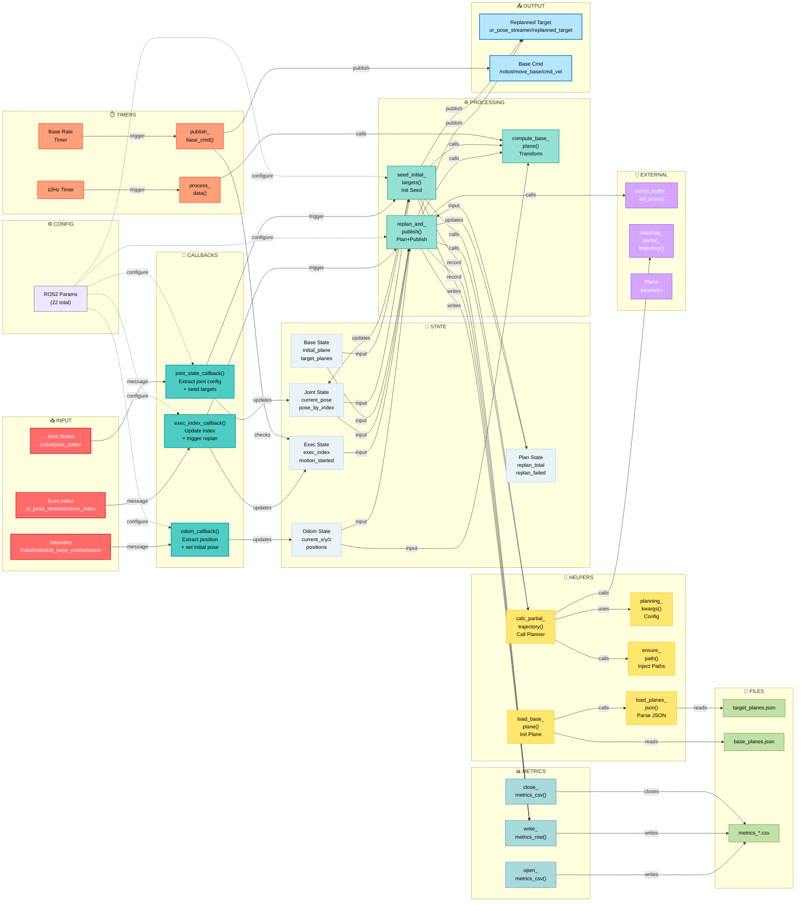

# OdomReaderNode Architecture

## Complete System UML Diagram



## Data Flow Summary

### Input → Processing → Output Pipeline

1. **Input Reception**: ROS topics publish messages
   - Odometry updates robot position
   - Execution index triggers replan cycles
   - Joint states initialize planning seed

2. **State Management**: Messages update internal state variables
   - Position tracking for odometry deltas
   - Execution progress tracking
   - Joint configuration caching

3. **Core Processing**: Main logic executes based on triggers
   - `_replan_and_publish()`: Triggered by exec_index updates
   - `_seed_initial_targets()`: Triggered by joint state callback
   - `_compute_current_base_plane()`: Applies odometry transform

4. **Helper Functions**: Support core processing
   - `_calculate_partial_trajectory()`: Invokes external IK/path planner
   - `_planning_kwargs()`: Prepares planner configuration
   - `_ensure_replanning_path()`: Manages Python import paths

5. **Metrics Recording**: All operations logged to CSV
   - Execution index, target index, latency
   - Compute time, path length, success flag

6. **Output Publishing**: Results sent to ROS topics
   - Replanned targets → ur_pose_streamer/replanned_target
   - Base commands → /robot/move_base/cmd_vel

7. **Timer Loops**: Scheduled background tasks
   - 10Hz: Process odometry and log base plane
   - Configurable rate: Publish base motion commands

## Function Call Hierarchy

```
OdomReaderNode.__init__()
├── _open_metrics_csv()
├── _load_planes_from_json() → target_planes
├── _load_initial_base_plane_from_json()
│   └── _load_planes_from_json() → base_planes
├── create_subscription(odom_topic, odom_callback)
├── create_subscription(exec_index_topic, exec_index_callback)
├── create_subscription(joint_state_topic, joint_state_callback)
├── create_publisher(replanned_target_topic)
├── create_publisher(move_base_cmd_topic)
└── create_timer(10Hz, process_data)

odom_callback(msg)
└── Updates: _current_odom_position, current_x/y/z

exec_index_callback(msg)
├── Updates: exec_index, latest_exec_index
└── Calls: _replan_and_publish()

joint_state_callback(msg)
├── Updates: current_joint_pose
└── Calls: _seed_initial_targets()

_seed_initial_targets()
├── _compute_current_base_plane()
├── _planning_kwargs()
├── _calculate_partial_trajectory()
│   ├── _ensure_replanning_path()
│   └── calculate_partial_trajectory() [EXTERNAL]
├── Publish to: replanned_target_topic
└── _write_metrics_row()

_replan_and_publish()
├── _compute_current_base_plane()
├── _planning_kwargs()
├── _calculate_partial_trajectory() [same as above]
├── select_buffer_tail_pose() [EXTERNAL]
├── Publish to: replanned_target_topic
└── _write_metrics_row()

process_data() [10Hz Timer]
├── _log_current_base_plane_if_needed()
│   └── _compute_current_base_plane()
└── Logs: base plane position deltas

_publish_base_move_cmd() [Base Rate Timer]
└── Publish to: move_base_cmd_topic

close_metrics_csv()
└── Flush and close metrics file
```

## Parameter Configuration

All behavior controlled via ROS2 parameters:

| Parameter | Type | Purpose |
|-----------|------|---------|
| `odom_topic` | string | Odometry subscription topic |
| `exec_index_topic` | string | Execution index subscription topic |
| `joint_state_topic` | string | Joint states subscription topic |
| `replanned_target_topic` | string | Replanned target publication topic |
| `move_base_cmd_topic` | string | Base movement command publication topic |
| `target_planes_json` | string | Path to target planes JSON file |
| `base_planes_json` | string | Path to initial base plane JSON file |
| `lookahead_nodes` | int | Number of nodes to plan ahead |
| `robot_buffer_size` | int | UR buffer size for replanning |
| `rotation_mode` | string | Planning rotation mode ('True'/'False') |
| `rotation_angle_deg` | float | Rotation angle for planning |
| `rotation_steps` | int | Number of rotation steps |
| `rotation_angle_cw_deg` | float | Clockwise rotation angle |
| `rotation_angle_ccw_deg` | float | Counter-clockwise rotation angle |
| `path_builder_iterations` | int | Iterations for path building |
| `enable_collision_check` | bool | Enable collision checking |
| `collision_data_path` | string | Path to collision data |
| `suppress_motion_planning_messages` | bool | Suppress planner console output |
| `log_current_base_plane` | bool | Log base plane updates |
| `base_plane_log_rate_hz` | float | Frequency for base plane logging |
| `record_metrics_csv` | bool | Enable metrics CSV recording |
| `metrics_csv_dir` | string | Directory for metrics CSV files |
| `move_base_linear_x` | float | Linear velocity for base motion |
| `move_base_rate_hz` | float | Frequency for base motion commands |
| `joint_names` | string[] | UR joint names to track |

## Key State Variables

- **Position Tracking**: `current_x`, `current_y`, `current_z`, `_current_odom_position`
- **Execution Tracking**: `exec_index`, `latest_exec_index`, `_base_motion_started`
- **Joint Tracking**: `current_joint_pose`, `planned_joint_pose_by_index`
- **Planning State**: `_replan_total`, `_replan_failed`, `last_published_replanned_index`
- **Base Frames**: `_initial_base_plane`, `_initial_odom_position`, `target_planes`
- **Metrics**: `_metrics_csv_file`, `_metrics_csv_writer`
- **Flags**: `data_received`, `_initial_seed_done`, `_replan_path_injected`

## I/O Summary

### Inputs
- **ROS Topics**: 3 subscribers (odometry, execution index, joint states)
- **JSON Files**: 2 files (target planes, base planes)

### Outputs
- **ROS Topics**: 2 publishers (replanned targets, base motion commands)
- **CSV Files**: 1 metrics recording file per run

### Processing
- **12 main functions** in OdomReaderNode class
- **2 external dependencies**: `calculate_partial_trajectory()`, `select_buffer_tail_pose()`
- **2 timer loops**: 10Hz main loop + configurable base command rate
